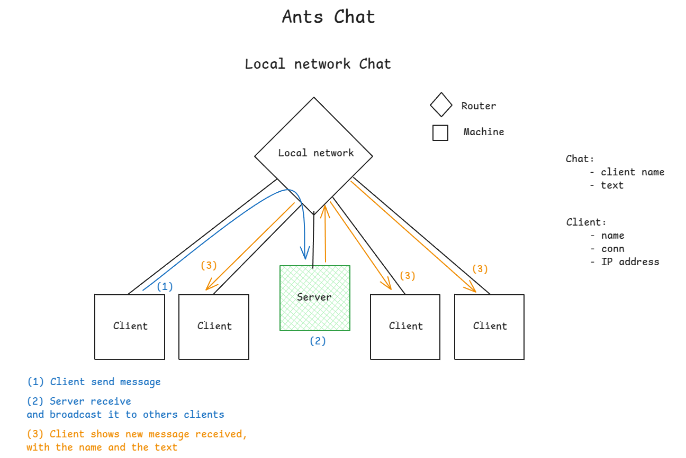

# ants-chat

🐜 - A Local Network chat built in Go

The goal is to build a local network chat where clients can connect to server, send / receive message to other clients.
This project is designed to be educational and fun, providing a hands-on experience with distributed systems and concurrent programming in Go.

---

--- 

This project is inspired from another one [Marmot Reduce](https://github.com/0xHumban/marmot-reduce)

---
## License

This project is open-source and licensed under **MIT**.

